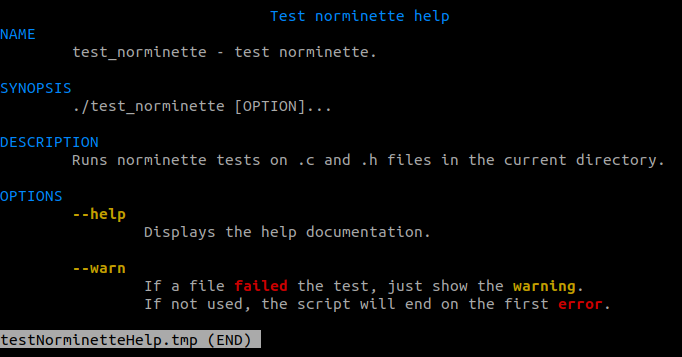
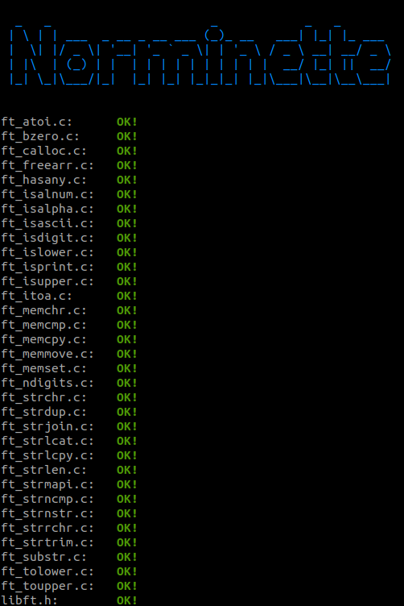

# Norminette tester:

Tool to automate the testing of files using [norminette](https://github.com/42School/norminette).

	./norminette_tester.sh --help

	./norminette_tester.sh

## Usage:

- Just run it:

		sh -c "$(wget https://raw.github.com/jkutkut/Sh-Norminette_Tester/master/norminette_tester.sh -O -)"

- Just run it with curl:

		sh -c "$(curl -sL https://raw.github.com/jkutkut/Sh-Norminette_Tester/master/norminette_tester.sh)"

- Download it:

		wget https://raw.github.com/jkutkut/Sh-Norminette_Tester/master/norminette_tester.sh

- Download it with curl:

		curl -sL https://raw.github.com/jkutkut/Sh-Norminette_Tester/master/norminette_tester.sh -o norminette_tester.sh